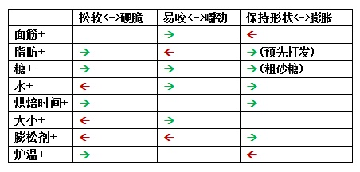

# 面包，蛋糕和曲奇，同样都是烘焙的，口感就是不一样

## 面粉性质

蛋白质含量及淀粉种类是区分不同面粉的两个主要性质，蛋白质如果是百分之十几的，多半是高筋粉，如果是百分之七八，那就是低筋粉。烘焙的蓬松或酥脆的特性来源于材料中充填的气体。如何制造除这种气体造成了烘焙的不同口感。

## 气体来源

面包的气体来自于发酵。在制作面包的面团时，首先要进行充分的搅拌，意义就在于使得小麦蛋白通过二硫键结合，形成面筋。使用高筋粉时，由于蛋白质的含量较高，面筋产生相对容易。发酵的过程中，酵母菌产生的气体被具有极高延展性的面筋包裹住，形成一个个的小气室。烘焙开始后，这里面的气体开始膨胀，最终，温度达到一定值以后，蛋白质变性淀粉糊化，把这个小气室固定了下来。高筋粉可以让面包更有弹性，更蓬松。

蛋糕中的气体来自于搅拌本身。制作通常要对全蛋液或者蛋白液首先进行充分的搅拌，产生充足的气泡。搅拌过程中，蛋液中的蛋白质部分变性，表面张力也有所改变，形成了比较结实的膜包裹住了搅拌的空气。蛋糕中加入的面粉最终被混合在这一个泡沫结构当中，在被加热以后形成一个支撑结构，并不参与包裹空气。因为蛋糕都是在搅拌充填气体之后才加的面粉，如果形成面筋包裹气体，在能搅拌形成足够的面筋之前，蛋液的气泡早就破裂光了。而且面筋的较高的弹性会限制烘焙中蛋糕的膨胀。蛋糕的制做要求搅拌尽量少，以尽量避免面筋的形成，直观来说，如果尝试用高筋粉做蛋糕，那么做出来多半是小小的，并且不松软。在蛋糕制作中加入淀粉，主要是为了降低面粉中蛋白质含量的比例，让成品更松软。

曲奇的酥脆的根本来源是高比例的脂肪，较低的水分。此二者都干扰了面筋的形成。烘烤过程中，曲奇烘烤得比蛋糕或者面包都要充分（因为较薄的原因），绝大多数的水分在烘烤中流失了。而此时面团中缺乏较强的面筋结构，故而会十分酥脆。

曲奇制作要领：

